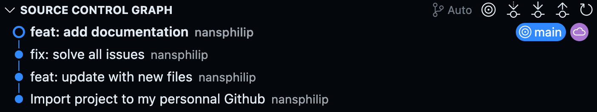

# Docker Discover

This project aims to discover the basics of containerization with Docker in a production environment.

Here is the project assignment: [TODO-NEXT-SESSION.md](./TODO-NEXT-SESSION.md)

<h2>Table of Contents</h2>

- [Prerequisites](#prerequisites)
- [Installation](#installation)
  - [Local mode](#local-mode)
  - [Containerized mode](#containerized-mode)
  - [Git History](#git-history)

## Prerequisites

Local mode is ideal for development and containerized mode is perfect for production.

1. Local mode

    - Node.js
    - MySQL

2. Containerized mode

    - Docker

## Installation

Here are the steps to install the project in both modes.

> [!TIP]
> Local mode can also be used to test production.

### Local mode

- Prepare MySQL

    - In your terminal, access your local MySQL client

    ```bash
    mysql -u root -p
    ```

    - Then execute the commands from the [setup-local.sql](./todo-api/prisma/sql/setup-local.sql) file to create the database and user
    - You can verify that everything is correct by trying the commands from the [show.sql](./todo-api/prisma/sql/show.sql) file

- Prepare the back-end

    - Go to the `todo-api` folder, create a `.env` file from the `.env.local.example` file then install dependencies

    ```bash
    cd todo-api
    cp .env.local.example .env
    npm install
    ```

    - Generate the Prisma client and deploy migrations

    ```bash
    npm run prisma:generate
    npm run prisma:deploy
    ```

    - Launch the Nest.js server

    ```bash
    # Development mode
    npm run start

    # Production mode
    npm run start:prod
    ```

- Prepare the front-end

    - Go to the `todo-app` folder, and install dependencies

    ```bash
    cd todo-app
    npm install
    ```

    - Launch the front-end

    ```bash
    # Development mode
    npm run dev

    # Production mode
    npm run build
    npm run start
    ```

### Containerized mode

- Launch the project with this command

```bash
docker compose up -d --build
```

- Stop and clean the project with this command

```bash
docker compose down -v
```

### Git History

I almost completed the project the same evening of the first session on a branch of the [g4.2025.devops](https://github.com/DuperSope/g4.2025.devops) repository.

I then migrated to my personal Github but I didn't recover my commits at that time...

This is why I only have the history of the small corrections I made this weekend before submission.


